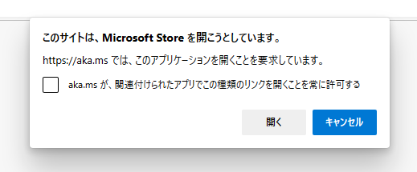

# PowerBIについて 
PowerBIはマイクロソフト社のビジネスインテリジェンス ツールです。色々なデータ群からデータを抽出、加工、分析をすることができます。
無料で使える機能、有料で使える機能があります。
## 公式サイト
https://powerbi.microsoft.com/ja-jp/

### PowerBI デスクトップ
PowerBI デスクトップの"無料でダウンロードする"を選択します。

マイクロソフトストアを開くため、確認のメッセージが表示されますので、"開く"を押してください。

## QGISについて解説されているサイト
https://note.com/kinari_iro/n/n0be263aa0fdc#un1xg
