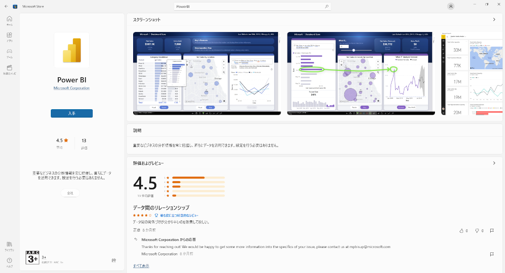
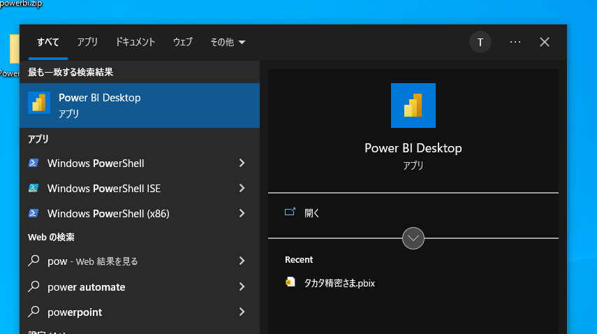
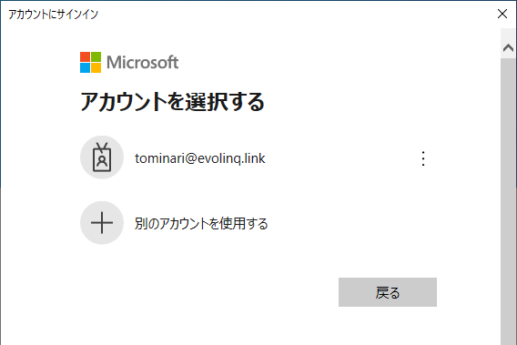
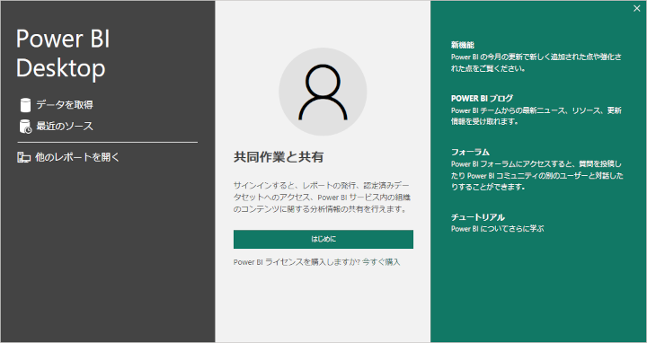

# PowerBI インストール方法

## 公式サイト
https://powerbi.microsoft.com/ja-jp/

### PowerBI デスクトップ
PowerBI デスクトップの"無料でダウンロードする"を選択します。

1. マイクロソフトストアを開くため、確認のメッセージが表示されますので、"開く"を押してください。

2. ”入手”ボタンをクリックします。
   

3. スタートメニューからPowerBIを起動します。

4. アカウント選択が表示されます。企業のアカウントがない場合、”戻る”を選択してください。

5. 企業アカウントではない場合、”共同作業と共有”画面が表示されます。右上の"×"をクリックして画面を閉じてください。

以上でインストールは、完了です。
