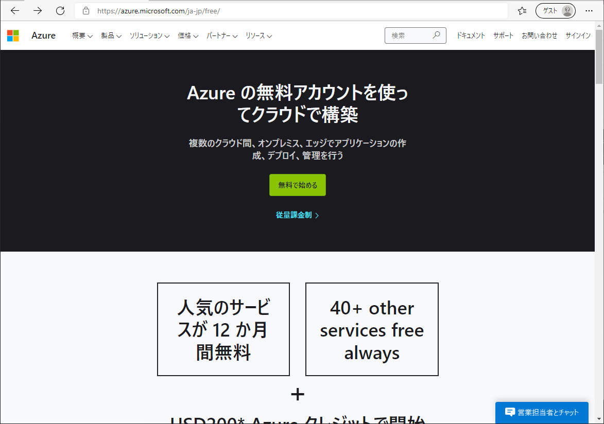
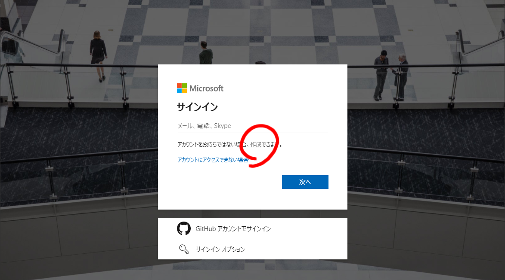
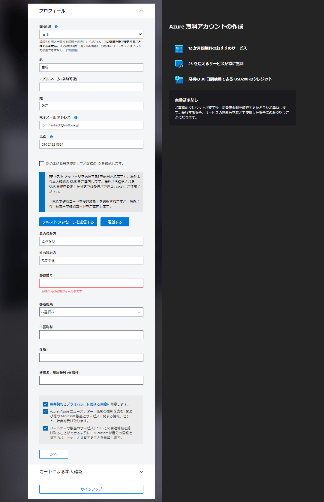
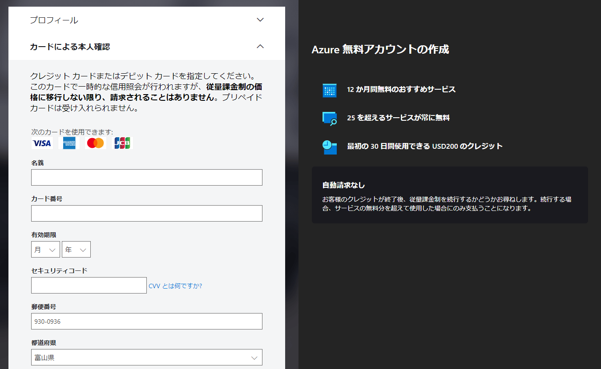

# Azureのアカウント登録
- 「無料ではじめる」ボタンを押す。

- 「作成」ボタンを押す。

- 「」ボタンを押す。

- サインアップ画面で、情報を入力します。入力後まず、「テキストメッセージを送信する」を押してください。スマートフォンに確認コードが届くので、所定の位置に確認コードを入力します。その後、「次へ」ボタンを押してください。

- 次のクレジットカードを使った本人確認を行います。

- 契約とプライバシーに関する声明に同意]し、「サインアップ」をクリックします。
- クレジットカードの登録が終わると、Azureが利用可能となります。

詳しくは、以下のページを参考にしてください。 
https://cloud.nissho-ele.co.jp/blog/azure_registration2020/
