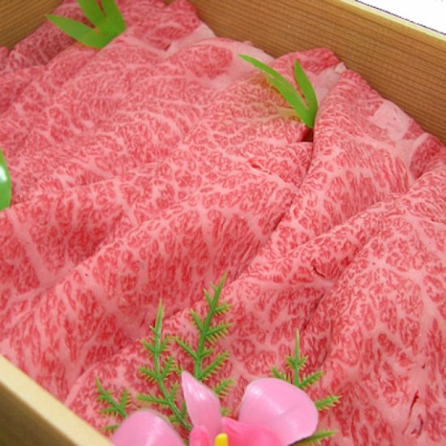
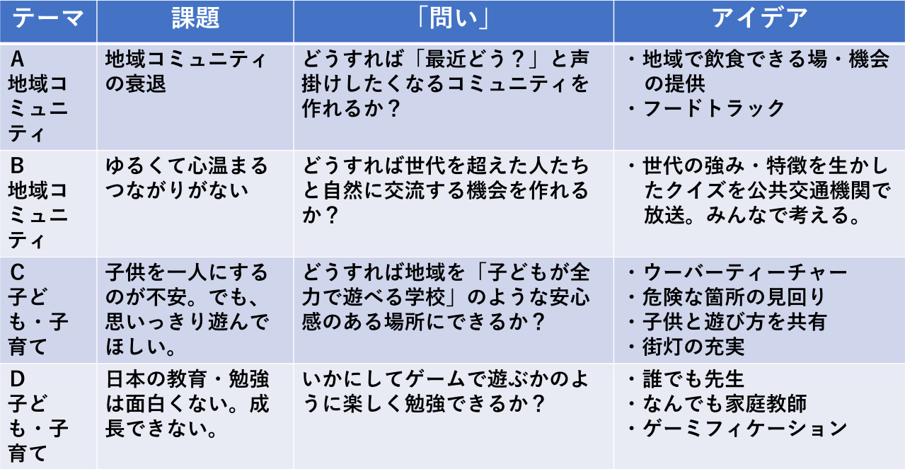

# 河本さま資料
https://mochan-tk.github.io/udc2021-handson-line-bot/#0

# スマシテラボハッカソン UDC2021 
# ”みんなでつくるちょっといい”
- 2022/1/22(土) 13:00～ 1/23(日) 17:00 
##  プレイベント(終了しました！)
1. 日時 1/21(金) 19:00-21:00(予定, 出入り自由)
1. 目的 
ハッカソンの事前準備をやるためのオンラインイベントとなります。
1. 会場 
zoomによるオンライン会場です。 
https://us06web.zoom.us/j/85170810866?pwd=RmJNV3J1Rkw3S0ViREZQM2dDbjdCUT09
 ミーティングID: 851 7081 0866
パスコード: 128855
1. スケジュール
- 19:00 会場
- 以降、ご参加の方から質問をうけながら、進めていきます。
- 富山市のセンサーネットワークの使い方を知りたい方への説明を可能です。

## お願い！
以下のリンクをクリックして、チャットツールに参加してください。
https://join.slack.com/t/codefortoyama/shared_invite/zt-dnexhi6s-yavCx3dO0YlsBi_BjfechQ

## スマシテラボハッカソン 初日
1. 日時 1/22(土) 13:00-18:00
1. 場所  
対面会場 スケッチラボ 
オンライン会場 zoom(申込者にご案内します)
1. 賞品 
最優秀賞のみ 
〇 氷見和牛肩ロースすきしゃぶ用（450g） 
優勝チームの皆さまに、後日、クール便で配送いたします。本来なら、皆さまと鍋をつつきたいところですが、時節柄、大切な方とお楽しみください。 

1. 参加賞(スケッチラボでのご参加の方に限ります) 
〇 協力会社さまからのステキなノベリティがもらえます！
1. お願い 
参加される方で、質問などで画面を共有する場合があると思います。その際は、以下のzoomに接続してください。 
会場でご参加のかたは、音響は会場のものを使います。スピーカーOFF / マイクミュートでお願いします。 
トピック: スマシテラボハッカソンUDC2021
時間: 2022年1月22日 01:00 PM 大阪、札幌、東京
Zoomミーティングに参加する 
https://us06web.zoom.us/j/88413935743?pwd=clNONE10WVJWT3RiaVBSU3IySWY3UT09 
ミーティングID: 884 1393 5743 
パスコード: 635922 

### スケジュール
- 12:30 講師等接続確認
- 12:45 開場
- 13:00 開会 
主催者挨拶(富山市未来戦略室長 青山氏)
協力者・審査員の紹介
- 13:05から15:05   
LINEボットハンズオン（体験会） 
講師 LINE株式会社 テクニカルエバンジェリスト 河本さん 
- 15:05から15:20 休憩
- 15:20から16:00 チームビルディング 
テーマに別れて、チームを決めます。 

- 16:00から17:30 
チームごとに作業を実施します。 
17:30から以下の発表(口頭)をしてもらいます。 
1) やることの概要 
・全体像 
・ハッカソンでつくる範囲 
・どこまでがモックアップで、どこをプログラムでつくるのか・・・。
2) 担当分け 
・プログラム担当 
・ボットのシナリオ担当 
・プレゼン資料担当 
・など 
発表内容について、河本さん、冨成で意見交換しながら、コメントします。
- 初日は終了です。
### 懇親会オンライン & 開発オンライン部屋
折角なので、軽くだけ飲みながら話しましょう。チームごとのブレイクアウトルームもつくります。大部屋は飲みながら、つくる部屋。出入り自由です。
- 19:30 開場
- 適当に解散します

## スマシテラボハッカソン ２日目
1. 日時 1/23(土) 10:30-17:00 注 10:30に開場しますが、おそくても13:00までにお集まりください。
1. 場所  
対面会場 スケッチラボ 
オンライン会場 zoom(申込者にご案内します)
### スケジュール
- 10:30 開場
- 13:00 中間発表会  
以下の発表をしてもらいます。 
1) チーム名 & 作品名発表 
2) 困ってる & お助けなど 
発表内容について、河本さん、冨成で意見交換しながら、コメントします。
- 16:00 発表会(Youtube 中継します & 一般公開します)  
- 1チーム 10分 
- 16:30 審査会 & 意見交換会
- 16:45 審査結果発表 & 肉贈呈式 & ご講評(河本さん)

# ハッカソンの成果物
1. アプリケーションまたはダッシュボードなど
1. プレゼンテーション資料
1. 寸劇(任意)

# 審査項目（各25点）
発表資料には、以下のPRを必ず盛り込んでください。
1. 課題設定
1. アイディア
1. 拡げ方, 巻き込みかた
1. 完成度（リリースできそうか？）

# 審査委員
- 河本さん
- 召田さん
- 青山さん

