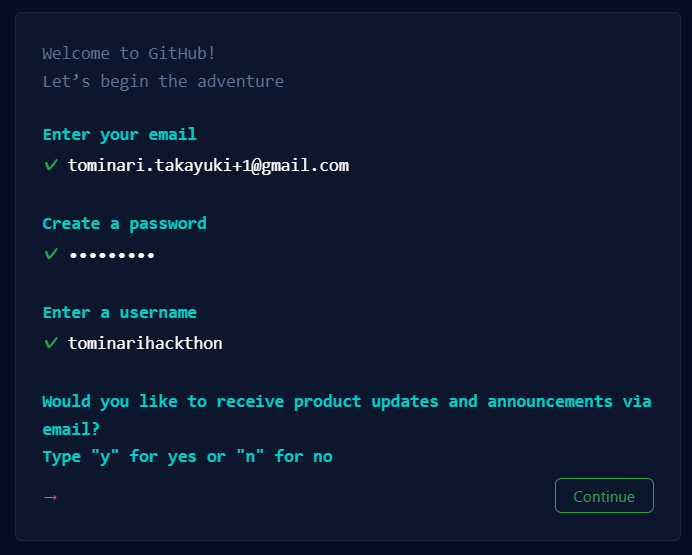

# GitHubのアカウント作成方法
- GitHubにアクセスします。
https://github.com/
- 画面右上にある「Sign up」ボタンを押します。(以下、項目を入力都度増えていきます。)

- 電子メールとパスワードを入力して、「continue」ボタンを押してください。なお、パスワードは数字と英字を含む8文字以上としてください。
- ユーザー名はアルファベットで指定します。入力後、「continue」ボタンを押してください。なお、パスワードは数字と英字を含む8文字以上としてください。
- 案内メールを送ってほしいときは'y', 不要なときは、'n'を押してください。
- 入力後、画像を選択する処理が動きますので、指示に従って入力してください。
- 最後に「Create Account」ボタンを押してください。
- 画面が切り替わり、codeが要求されます。メールにcodeが届いていますので、codeを入力してください。

以上でGitHubのアカウント登録は完了です。