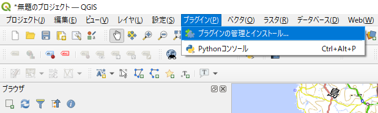
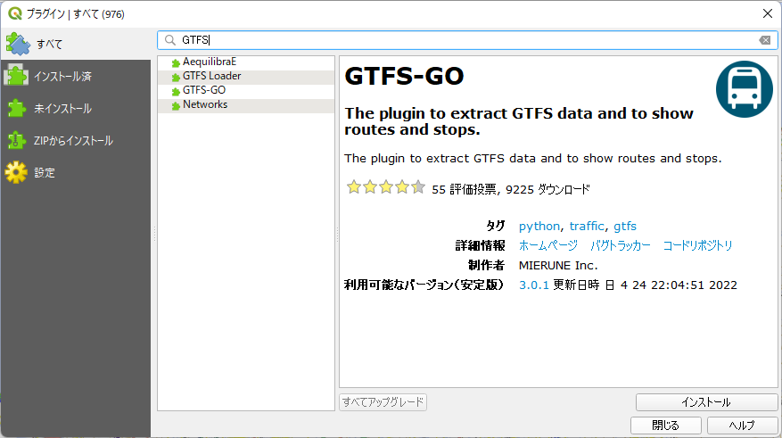
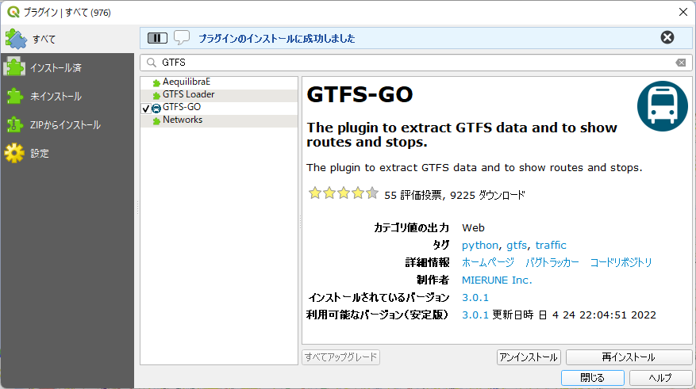
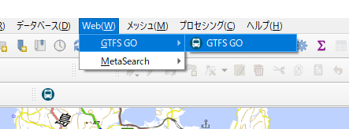
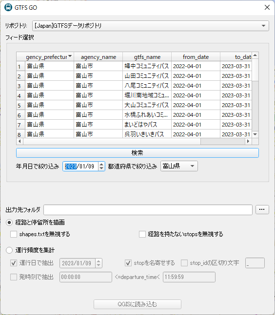
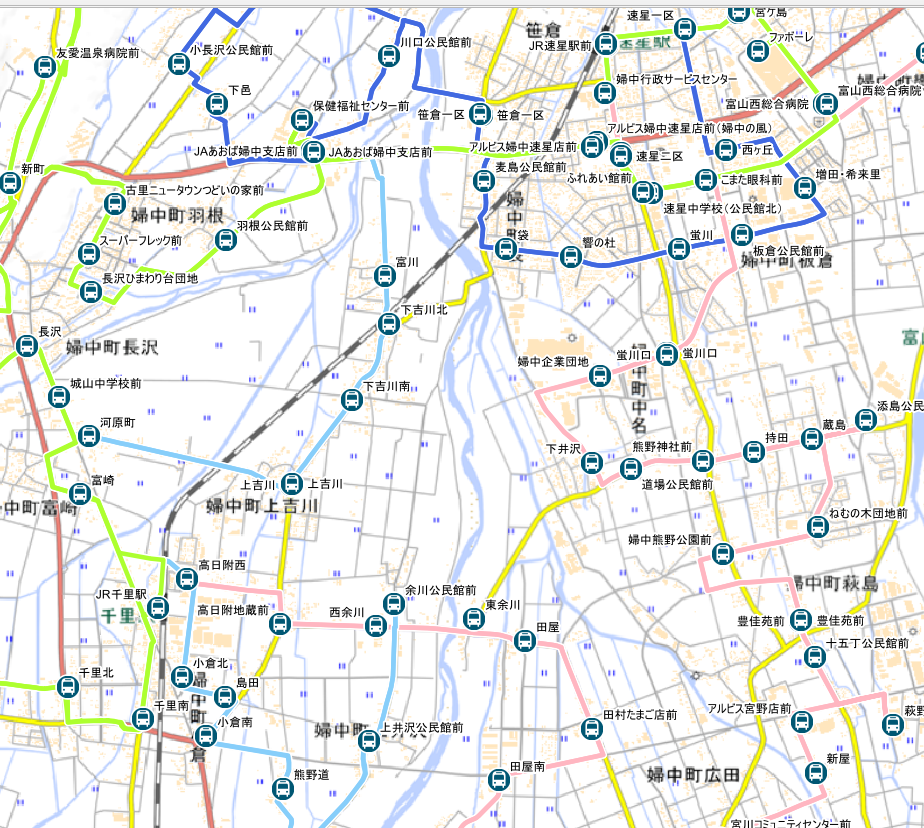
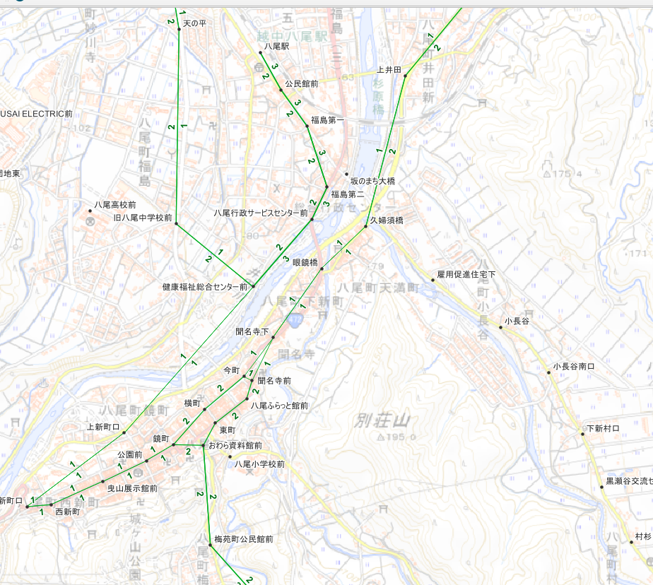

# GTFS-GOの使い方
GTFS-GOは、バス情報のバス停・時刻表等標準データ形式(GTFS)をQGIS上に表示するための便利なプラグインです。

1. QGISを起動します。
2. GTFS-GOプラグインをインストールします。まず、プラグインメニューから、「プラグインの管理とインストール」を選びます。

  

3. プラグイン管理画面で、検索項目に"GTFS-GO"と入力し、検索します。一覧から、”GTFS-GO”を選択してから、「インストール」ボタンを押します。

4. インストールが完了すると、”プラグインのインストールに成功しました”と表示されます。「閉じる」ボタンを押してください。

5. インストールが完了したら、WEBメニューから”GTFS-GO”を起動します。

6. GTFS-GOの画面が表示されたら、以下のとおり入力します。

   1.  リポジトリに"[Japan]GTFSデータリポジトリ"を選択してください。
   2.  "都道府県で絞り込み"では、"富山県"を選択してください。
   3.  「検索」ボタンを押してください。
   4.  リストに出てきたバス路線から、お好みのバス路線を選んでください。バス路線は、複数選択することができます。
   5.  出力先フォルダには、GTFSデータなどを格納するフォルダを指定してください。
   6.  「経路と停留所を描画」を選んで、「QGISに読み込む」ボタンを押すと、地図上にバス停およびバス路線を表示します。
   7.  「運行頻度を集計」を選んで、「QGISに読み込む」ボタンを押すと、地図上にバスの運行本数を表示します。このときは、運行日を指定（特に曜日に注意）、時刻も指定するようにします。
   
* 「経路と停留所を描画」の表示例
  
 

* 「運行頻度を集計」の表示例
  
 

