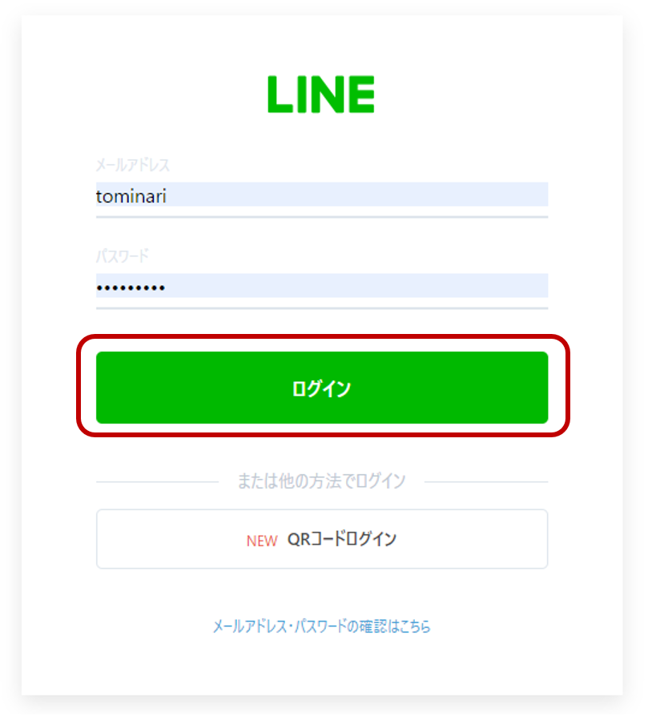
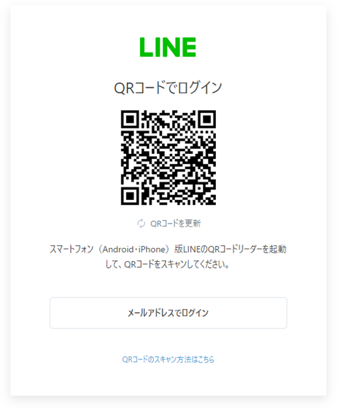
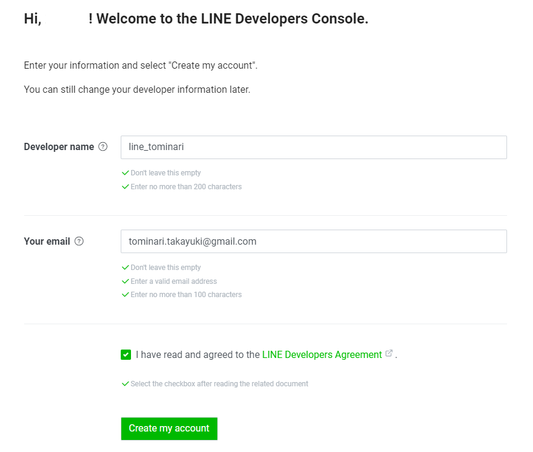
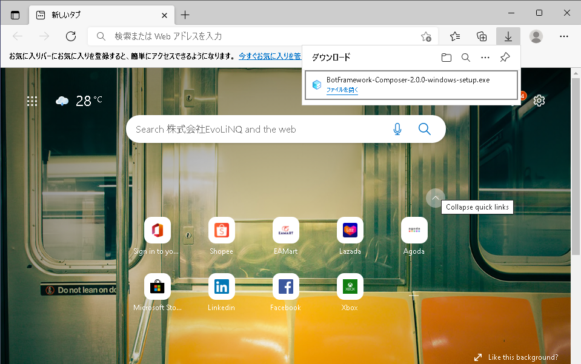
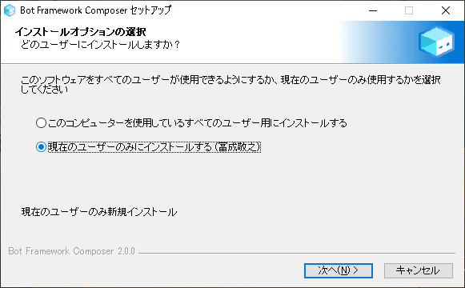
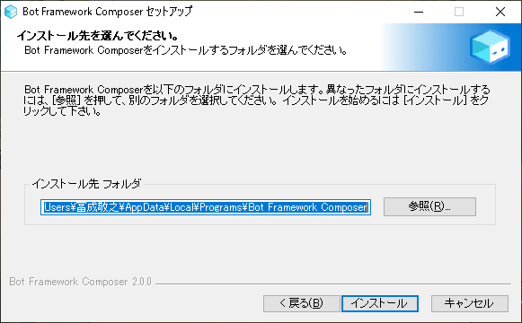
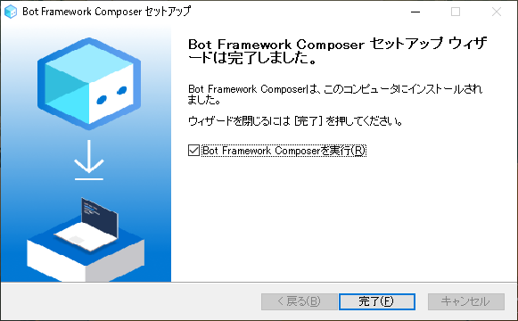

# ラインボット作成の事前準備
## 必要なこと
### LINEの開発用アカウント作成
- 以下のサイトにアクセスします。 
https://account.line.biz/login

- 既にLINEの開発用アカウントをお持ちの方は、ログインをしてください。
- 以下は、LINE開発用アカウントをお持ちでない方の手順となります。
- LINE開発用アカウントを持っていない方は、「ＱRコードログイン」を押してください。

- スマートフォンでLINEを立ち上げて、QRコードを読み取ります。
- ログイン確認画面が表示されるので、「ログイン」を選択します。

- LINE開発用アカウントの登録画面(英語)が表示されます。
- developper name にはユーザ名(自由指定)を入力してください。
- Your email にはご自身の電子メールを入力してください。
- 「I have read and agreed to LINE Developper Agreement」を一読し、チェックしてください。
- 最後に、「Create my Account」をクリックします。
これで、LINE開発用アカウントが作成されます。

### GitHubのアカウントが必要となります。 
[githubのアカウント登録の説明ページ](../github/README.md)

### Microsoft Azureのアカウントが必要となります。アカウント作成時、クレジットカードが必要となります。クレジットカードは、本人確認用に利用します。（特別な操作を行わない限り課金はされません） 
[azureのアカウント登録の説明ページ](../azure/README.md)

### Bot Framework Composer のインストールが必要です。
- 以下のサイトから、ファイルをダウンロードしてください。以降Windows版のインストール方法を記載します。 
Win版 https://aka.ms/bf-composer-download-win  
Mac盤 https://aka.ms/bf-composer-download-mac  
- ダウンロードが終わったら、ダウンロードしたプログラムを実行してください(ファイルを開く)。

- 現在のユーザにのみインストールを行います。

- インストール先を指定します。通常は、変更せずに「インストール」を押してください。

- 「完了しました」と表示されれば、インストール完了です。

### node.jsのインストールが必要です(R3/1/17 追加)
Node.js : https://nodejs.org/en/download/

### .NET Core SDKのインストールが必要です(R3/1/17 追加)
.NET Core SDK : https://dotnet.microsoft.com/en-us/download/dotnet/3.1

事前準備は、以上となります。

