# Arduino Studio ポータブル版の作成
## 最新版をダウンロード

- 以下のサイトから、Arduino studio最新版(zip)をダウンロードする。
https://www.arduino.cc/en/software
- 適当なフォルダにzipを回答する。 
例.D:\arduino　(USBメモリなど)
- コピーしたフォルダに"portable"という名称のフォルダを作成する 
このフォルダがあるとき、Arduinno Studio は、このフォルダに色々な設定を保存するようになります。

## Arduino Studioにm5stick用の設定を行う
- Arduino Studio を起動する。
- 「ファイル」-「環境設定」を選ぶ。
- 「追加のボードマネージャのURL」に以下の設定を行う。 
https://dl.espressif.com/dl/package_esp32_index.json
- 「ツール」-「ボード:（何か入っている）」-「ボードマネージャ」を選ぶ。
- 「タイプ」の欄に”ESP32”と入力する。 
"esp32"のパッケージが表示されるので、インストールを行う。
- 「ツール」-「ボード:(何か入っている)」-「ESP32-Arduino」-「m5stick-c」を選ぶ。
- 「スケッチ」-「ライブラリをインクルード」-「ライブラリを管理」を選ぶ。
- 「ライブラリマネージャ」で「m5stick」と入力し、「M5StickC by M5StickC 」をインストールする。

## Arduino Studioのシリアルポートを設定する
- m5stick-cをパソコンンに接続し、「ツール」-「シリアルポート」-「COM3(数値は環境によって異なる)」を選ぶ。

## ambient(IoTサービス[無料]に登録する)
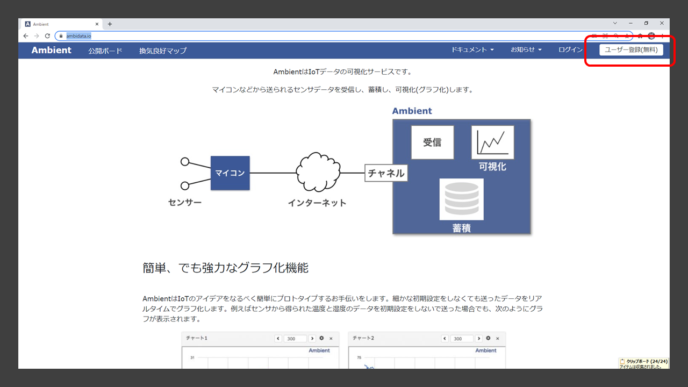
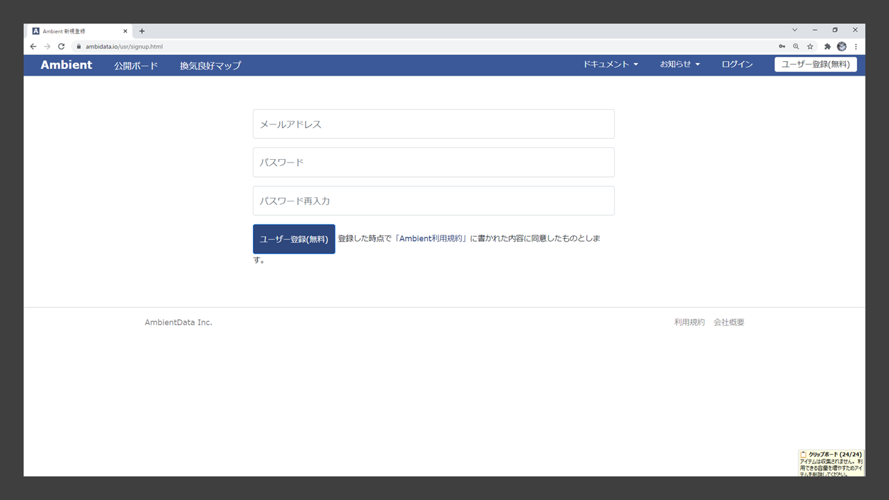
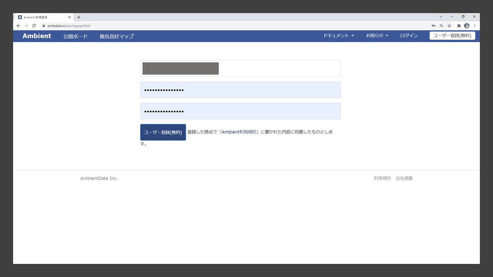
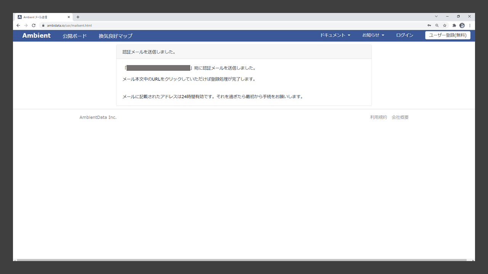
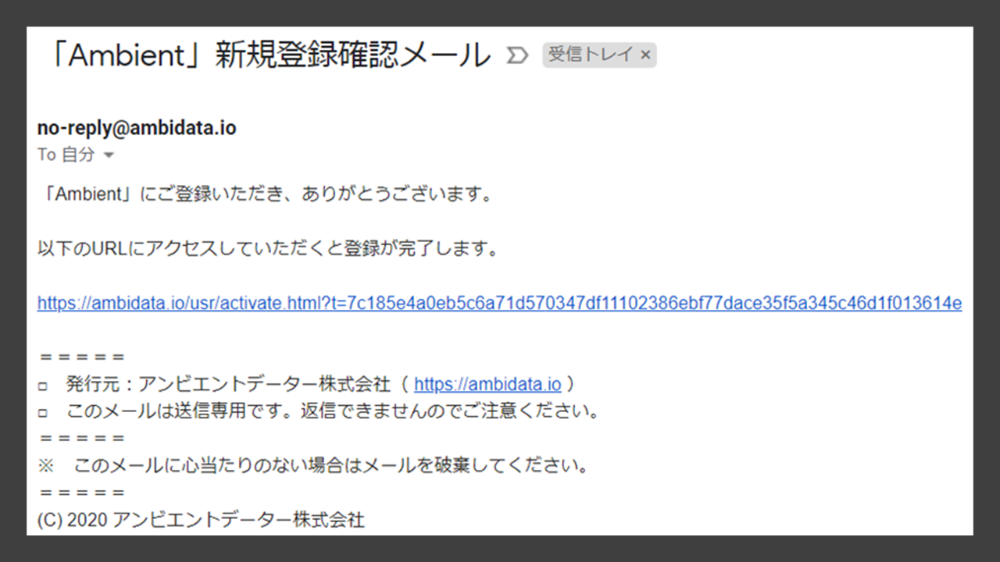
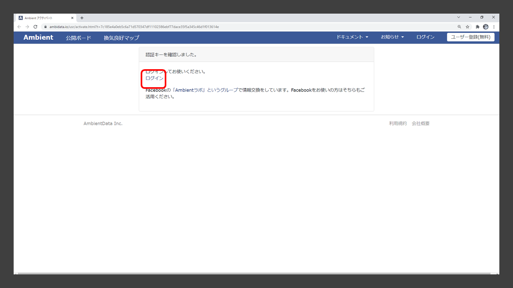
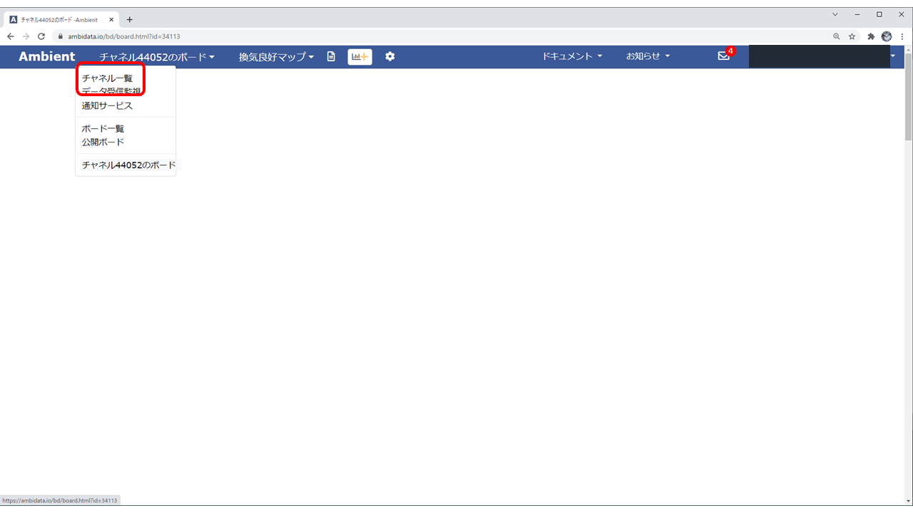
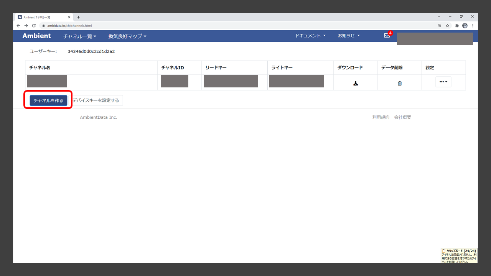
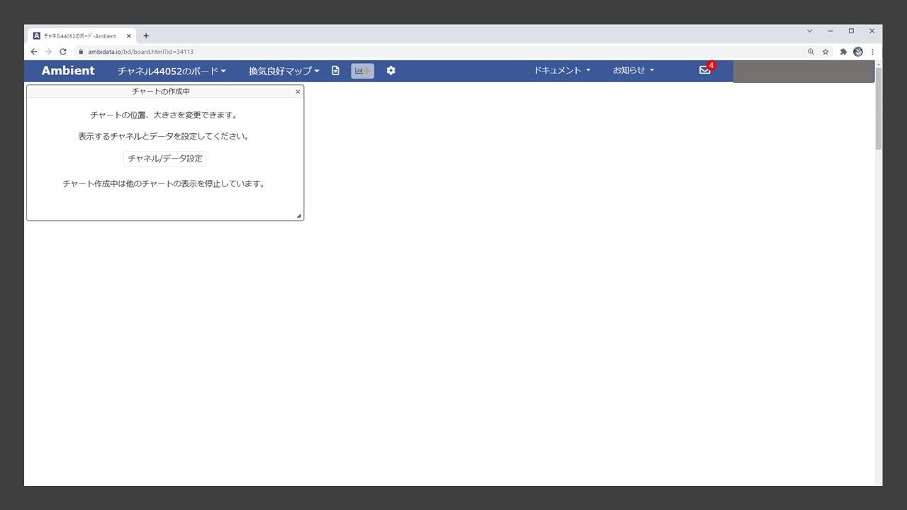
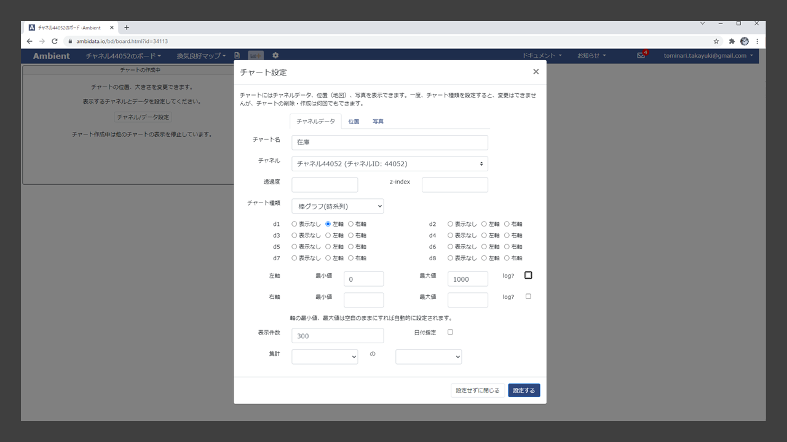
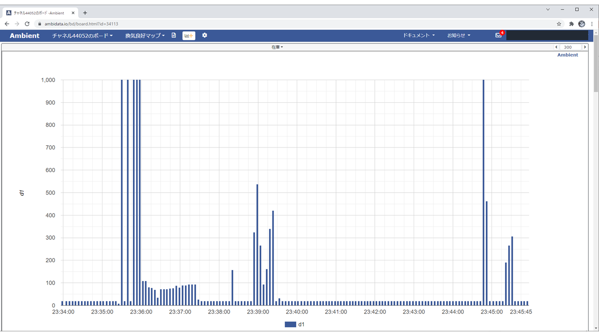

## Arduino StudioにAmbientライブラリを設定する
- Arduino IDEのライブラリマネージャを開き「ambient」で検索します。「Ambient ESP32 ESP8266 lib」の最新をインストールします。

## テスト 距離測定のツール(別途インストールしたもの)にAmbientの設定を行う。
- #include "Ambient.h"を追加する。
- 以下の行を, 適切な値に設定する。 
const char * ssid = "(会場の無線LAN)"; 
const char * password = "(会場の無線LANパスワード)
))"; 
const int channelId = (AmbientのチャンネルID); 
const char * writeKey = "(Ambientのライトキー))"; 
