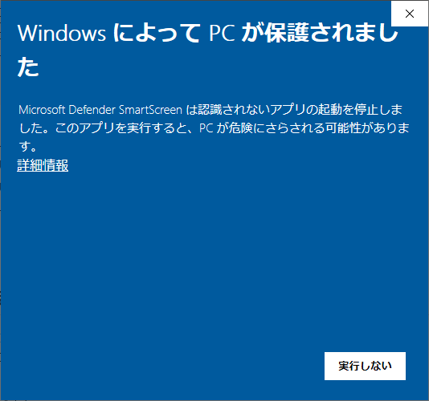

# m5stickv

Kendryte K210を搭載したAIカメラです。高性能なニューラルネットワークプロセッサ（KPU）とデュアルコア 64 bit RISC-V CPUを使用しており、低コストかつ高いエネルギー効率で高性能な画像処理を行うことができます。

https://www.switch-science.com/catalog/6651/

# easyloaderのインストール
-以下のサイトからeasyloaderダウンロードします。

https://docs.m5stack.com/en/core/m5stickv

-実行した際、以下の画面が表示されることがある。「詳細情報」を押下し、実行する。

