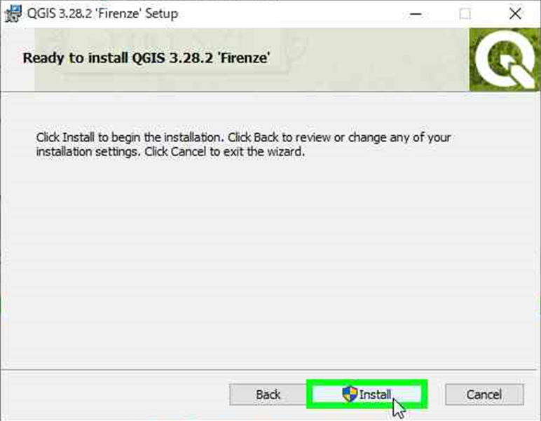

# QGISのインストール

1. QGISのサイト(https://qgis.org/ja/site/)にアクセスします。
1. "ダウンロードする"をクリックします。

1. お使いのPCにマッチしたQGISをダウンロードします。

1. 寄付の案内が表示されます（ご自由にお願いします）。

1. ダウンロードが終わったら、フォルダを開きます（画像はEdgeの場合）。

1. フォルダを開いたら、ダウンロードしたファイルをダブルクリックします。

 
1. 画面の指示に従って、インストールします。基本的に、デフォルト値で進めて大丈夫です。

ここでインストール確認が出た場合、"はい"を選択してください。

以上でインストール作業は、完了です。
