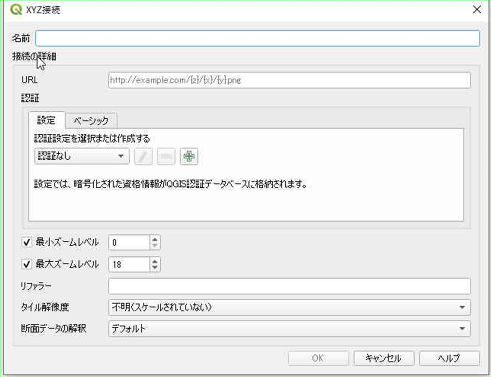

# QGISで地理院地図を表示する方法

1. QGISの新規プロジェクトを選択する。

2. XYZ Tilesを選んで、右クリックします。”新規接続”を選択します。

3. "XYZ接続"画面で、接続設定をします。

   1. 名称には自由な名前をつけることができます。今回は、「地理院地図（標準）」とします。
   2. URLには、 https://cyberjapandata.gsi.go.jp/xyz/std/{z}/{x}/{y}.png を設定します。
   3. 入力したら、"OK"ボタンを押します。

4. レイヤに地理院地図（標準）を追加します。

   1. 画面左上にある、"ブラウザ"からXYZ Tilesに追加された"地理院地図(標準)"をドラッグし、レイヤに追加します。

QGISでの地理院地図の表示方法は、以上のとおりです。