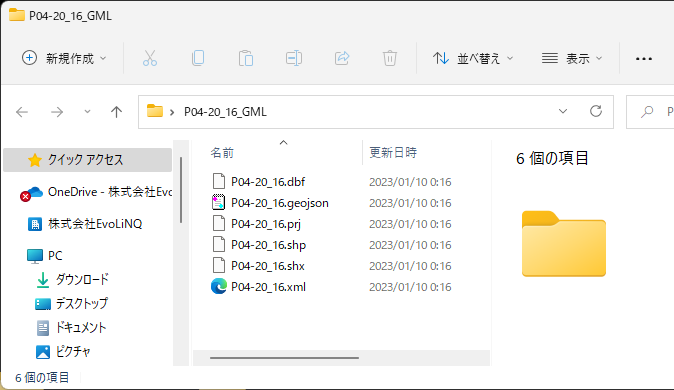

# Shapeファイルについて
富山県, 富山市のオープンデータは、必ずしも使いやすい形式で公開されていません。
公的なデータについては、地元のオープンデータを使うよりも、国土数値情報を利用する方が、お手軽といっても良いです。
国土数値情報に掲載されているデータの多くは、SHPファイルを形式ということもあり、簡単にQGISで表示することができます。

以下の例では、富山県の医療機関のデータを取得・表示します。

1. 国土数値情報にアクセスします。
https://nlftp.mlit.go.jp/index.html

2. 「医療機関（ポイント）」をクリックします。

3. 富山県の令和２年度のデータをダウンロードします。
    

    
4. ダウンロードしたzipファイルを展開します。
    

 
5. 展開したファイルから、拡張子がshpのファイルをドラッグし、QGIS上にドロップします。地図上にポイントが表示されます。
    

 
6. 国土数値情報のページに記載されている仕様を確認し、施設名を表示する設定をします。医療機関の場合、施設名称は、"P04_002"です。

7. QGISの左端のレイヤウィンドウで、医療機関のレイヤを右クリックし、プロパティを表示します。

プロパティ画面では、以下の通り入力します。
  1. 画面左のリストから、”ラベル”を選択する。
  2. 画面上のリストボックスから、"単一定義（single）"を選択する。
  3. 値(value)のリストボックスで、”P04_002”を選択する。
  4. 「OK」ボタンをクリックする。

他のShpファイルについても、ほぼ同様のやり方で対応可能です（ポイントデータの場合）。

