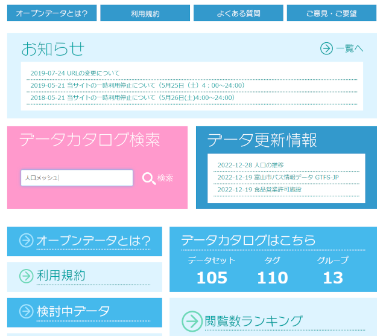
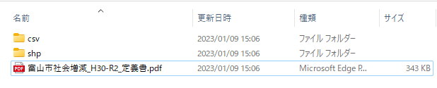
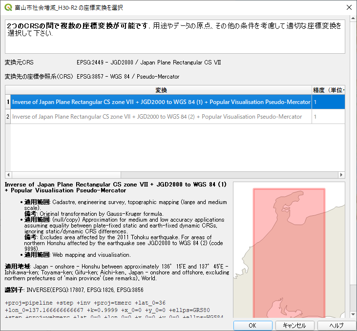

# 富山市オープンデータ(人口メッシュ)の使い方

## データのダウンロード
1. 富山市オープンデータサイト（https://opdt.city.toyama.lg.jp/）を開きます。

2. "人口メッシュ"でキーワード検索をします。

3. 都市関連メッシュデータから、"社会増減　２０１８年～２０２０年　２５０ｍメッシュ"を選択します。

4. "社会増減　２０１８年～２０２０年　２５０ｍメッシュ"のリンクをクリックして、データをダウンロードします。

5. ダウンロードしたデータ(zipファイル)を展開すると、CSVフォルダ, SHPフォルダおよび定義書のPDFが生成されます。

6. PDFファイルには、データの定義が記載されています。 

7. 展開したデータから、SHPフォルダ内にある拡張子.SHPのファイルを、QGIS上にドラッグ＆ドロップします

ドロップした際、座標変換の確認が出る時があります。これは、このまま"OK"ボタンを押してください。

追加したレイヤを選択し、右クリックで"プロパティ"を選択します。

* 「シンポロジー」を選択します。
* 一番上のプルダウンでは、「連続地による定義」を選択します。
* カラーランプは、増減値を表わすので、中央が白、マイナス値が青、プラス値を赤で表示するようにします。反転する場合は、”カラーランプを反転”を選択します。
* 

* モードから適切なものを選びます。また、クラス数も適当に選んでください。

* リストの"値"をクリックすると範囲設定の画面が表示します。

* メッシュの線がしつこく感じる場合、”シンボル”を選択後、表示される画面で、"シンプル塗りつぶし"を選びます。表示される画面で、"ストローク色"で"透明なストローク"を選択します。

* レイヤを並び替えて、地図を上（描画順番を後回し）にします。

* 地図レイヤのプロパティから、「グローバルな透明度」で

* 人口データの可視化方法は、以上のとおりです。表示する段階、色やどのデータを使うかについては、色々と試してみてください。

